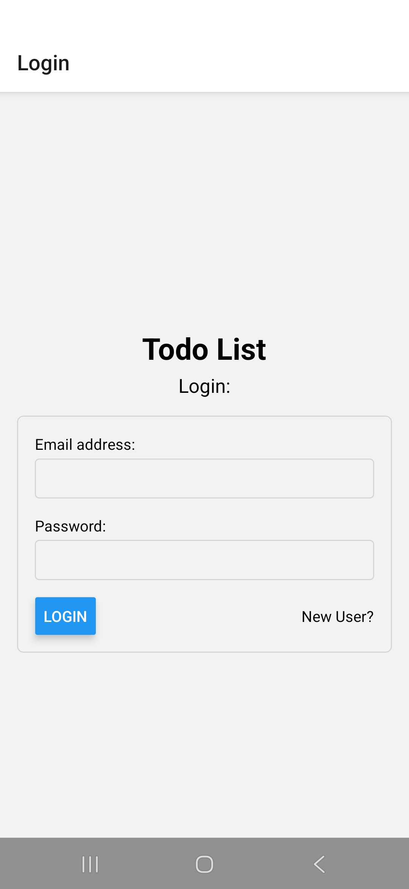
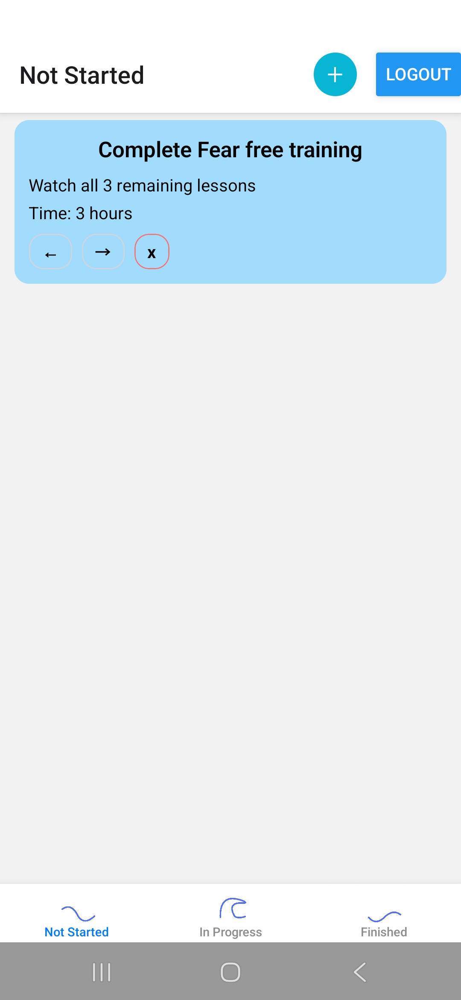
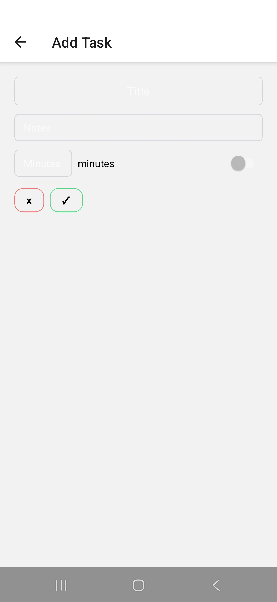

# todo-app (to be renamed to taskwave)
task logger and progress tracker

## To View
- [Web Application](https://todo-app-client-production.up.railway.app)

## Implementation
- MySQL Database
- Java Spring Boot Server
- JavaScript web platform
- React Native mobile interface
- Hosted with [Railway](https://railway.com)

## Road Map
Future plans are all concerning the to-be-released mobile app
- Release the application on Google Play
- Add local storage (to make account creation unnecessary)
- Remake UI

## Mobile App Screenshots (so far)

 

